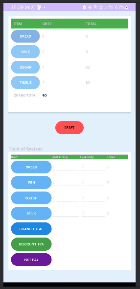

# POS inventory Android App built with Java

A simple Android Point-of-Sale (POS) app built with Java. It features:

- Button-based item addition for Bread, Milk, Sugar, and Tissue
- Auto price calculation per item
- Editable POS section with unit price and quantity
- Grand total, 15% discount, and net pay calculation
- Reset button for inventory section

## Tech Stack
- Java
- Android SDK
- XML for UI design

## 📱 App Screenshot

## License
MIT License
